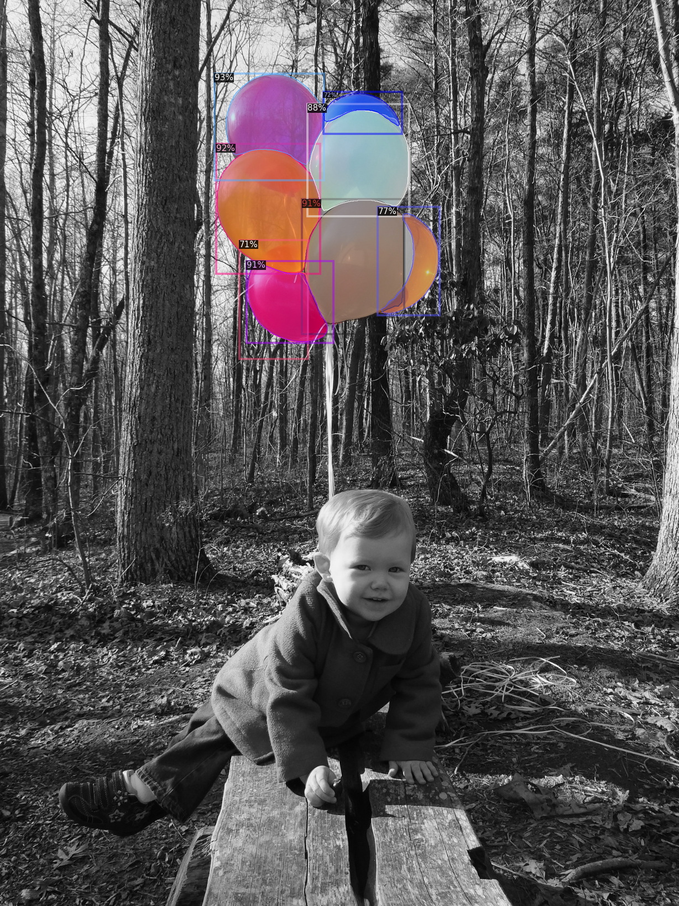
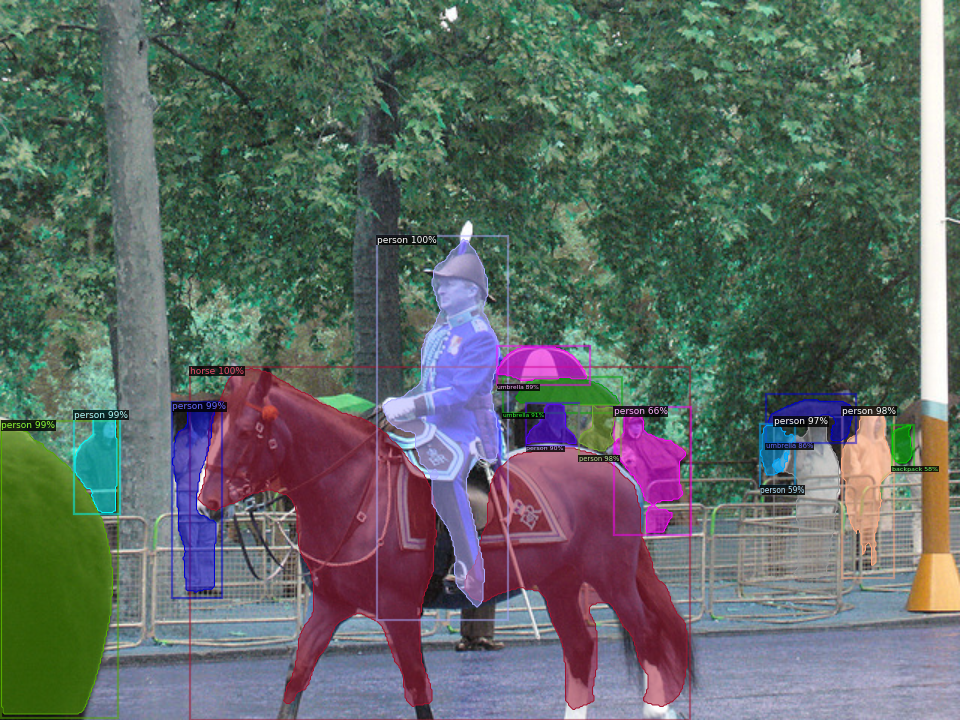
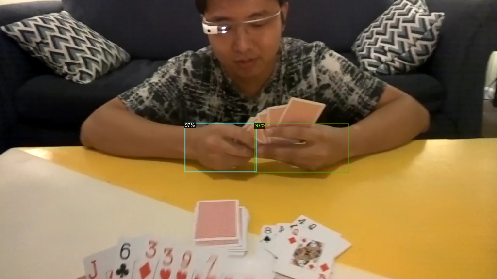
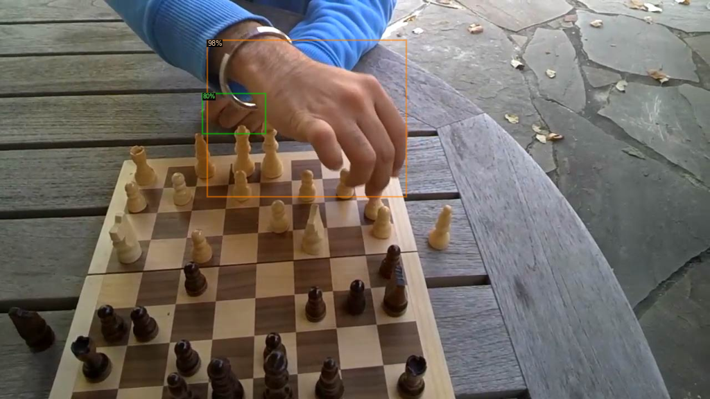

# Detectron-Notebooks

Notebooks containing implementations of Detection Algorithms that are part of [Detectron2](https://github.com/facebookresearch/detectron2), an Object Detection Framework by Facebook Research built on Pytorch.

## Instance Segmentation:

This Notebook is based on the initial colab notebook tutorial provided by Detectron2 Authors.

**Notebook Link:** [Balloon Detection and Segmentation using Mask RCNN](./notebooks/Balloon_Detection_Mask_RCNN.ipynb)

**Dataset Link:** [Matterport Balloon Dataset](https://github.com/matterport/Mask_RCNN/releases/download/v2.1/balloon_dataset.zip)

**Results:**

## Object Detection

**Notebook Link:** [Hand Detection using Faster RCNN](./notebooks/Hand_Detection_Detectron.ipynb)

**Dataset Link:** [Egohands Dataset](http://vision.soic.indiana.edu/projects/egohands/)

**Results:**

More notebooks on Detectron2 will keep coming.